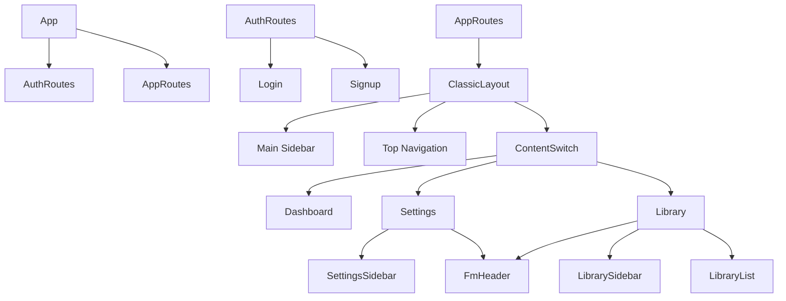

# Sisgate Hub - Visual Design & Page Structure

## 1. Global Application Structure
The application follows a standard React routing architecture split into two main zones:

*   **Public/Auth Zone (`/auth/*`)**
    *   Login, Signup, Lock Screen, Password Reset.
    *   Uses `AuthRoutes.jsx`.
    *   Layout: Centered card layout with split-screen image for desktop.

*   **Protected App Zone (`/*`)**
    *   Dashboard, Library, Settings, Chat, etc.
    *   Uses `AppRoutes.jsx` (Protected by Supabase Session).
    *   Layout: `ClassicLayout` (Sidebar + Top Navbar).

---

## 2. Main Layout (ClassicLayout)
All protected pages share this skeleton:

```text
+-------------------------------------------------------+
|  [Sidebar (Main Navigation)]                          |
|  - Dashboard                                          |
|  - Settings                                           |
|  - Library                                            |
|  - Apps (Chat, Email, etc.)                           |
|                                                       |
|  +-------------------------------------------------+  |
|  |  [Top Navbar (Search, User Profile, Notifs)]    |  |
|  +-------------------------------------------------+  |
|                                                       |
|  +-------------------------------------------------+  |
|  |                                                 |  |
|  |           [ MAIN CONTENT AREA ]                 |  |
|  |                                                 |  |
|  |  (Dynamic Content based on Route)               |  |
|  |                                                 |  |
|  +-------------------------------------------------+  |
+-------------------------------------------------------+
```

---

## 3. Page-Specific Structures

### A. Settings Page (`/settings`)
Uses a **Dual-Sidebar Layout** pattern derived from the File Manager design.

*   **Structure:**
    ```text
    +-----------------------+-------------------------------------------+
    | [Secondary Sidebar]   | [Main Panel]                              |
    |                       |                                           |
    | - Users               |  [Header: "Settings"]                     |
    | - Templates           |  [Button: Toggle Sidebar]                 |
    | - Audit Logs          |                                           |
    | - System Settings     | +---------------------------------------+ |
    |                       | | [Content Area]                        | |
    |                       | | - Forms                               | |
    |                       | | - Data Tables                         | |
    |                       | | - User Lists                          | |
    |                       | +---------------------------------------+ |
    +-----------------------+-------------------------------------------+
    ```
*   **Key Components:** `Settings`, `SettingsSidebar`, `FmHeader`.

### B. Library Page (`/library`)
Similar **Dual-Sidebar Layout** but focused on filtering and grid display.

*   **Structure:**
    ```text
    +-----------------------+-------------------------------------------+
    | [Secondary Sidebar]   | [Main Panel]                              |
    | (Filters)             |                                           |
    | - All Templates       |  [Header: "{Active Filter Name}"]         |
    | - Documents           |  [Search Bar]                             |
    | - Letters             |                                           |
    | - Starred             | +---------------------------------------+ |
    | - Trash               | | [Grid Layout]                         | |
    |                       | | [Card] [Card] [Card]                  | |
    |                       | | [Card] [Card] [Card]                  | |
    |                       | |                                       | |
    |                       | | (Title, Category, Eye/Download btns)  | |
    |                       | +---------------------------------------+ |
    +-----------------------+-------------------------------------------+
    ```
*   **Key Components:** `Library`, `LibrarySidebar`, `LibraryList`, `FmHeader`.

### C. Authentication Pages (`/auth/login`, `/auth/signup`)
*   **Structure:**
    ```text
    +-------------------------------+-------------------------------+
    | [Left Panel - Form]           | [Right Panel - Branding]      |
    |                               |                               |
    | - Logo (Sisgate Hub)          | - Background Image            |
    | - Input Fields                | - "Sisgate Hub 2.0" promo     |
    | - Action Buttons              | - Illustrations               |
    | - Footer Links                |                               |
    +-------------------------------+-------------------------------+
    ```

---

## 4. Component Hierarchy Reference


